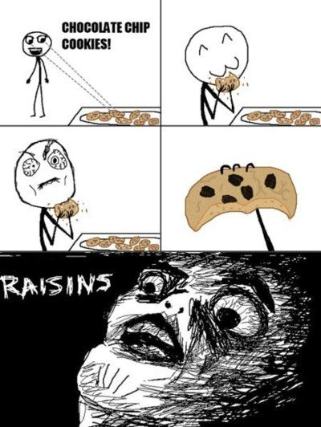

# `choco-raisin`
Chocolate chip vs raisin cookies image classification with [fastai](https://docs.fast.ai/)

Training notebook: [](https://colab.research.google.com/github/cstorm125/choco-raisin/blob/main/notebooks/train_image_classification.ipynb) 

Inference webapp: [](https://mybinder.org/v2/gh/cstorm125/choco-raisin/main?urlpath=voila%2Frender%2Fnotebooks%2Finferencer.ipynb)

Our goal is to train a model that saves humanity from the repeated tragedy:



We train a chocalate chip cookies vs raisin cookies image classifier with data obtained from [DuckDuckGo](http://duckduckgo.com/) image search. We obtained over 90% accruacy in the validation set.

## Repository Structure

```
- images
    - train
        -chocolate chip (572 images)
        - raisin (570 images)
    - valid
        -chocolate chip (144 images)
        - raisin (140 images)
- notebooks
    - train_image_classification.ipynb; train the model and basic inference notebook app
    - train_valid_splits.ipynb; splits and clean by hand
    - download_images.ipynb; download images
```

## Authors
@ben-mj and @cstorm125
